<div align="center">

# 🏋️ Personal Trainer AI - Sistema RAG

### Assistente Inteligente de Treino e Fitness com Retrieval-Augmented Generation

[](https://www.python.org/)
[](https://langchain.com/)
[](https://streamlit.io/)
[](https://www.docker.com/)
[](LICENSE)


</div>

---

## 📋 Índice

- [Sobre o Projeto](#-sobre-o-projeto)
- [Arquitetura](#-arquitetura)
- [Tecnologias Utilizadas](#-tecnologias-utilizadas)
- [Funcionalidades](#-funcionalidades)
- [Instalação](#-instalação)
- [Como Usar](#-como-usar)
- [Estrutura do Projeto](#-estrutura-do-projeto)
- [Configuração](#-configuração)
- [Demonstração](#-demonstração)
- [Testes](#-testes)
- [Contribuindo](#-contribuindo)
- [Roadmap](#-roadmap)
- [Licença](#-licença)

---

## 🎯 Sobre o Projeto

O **Personal Trainer AI** é um sistema inteligente de assistência para treinos e fitness que utiliza **Retrieval-Augmented Generation (RAG)** para fornecer respostas precisas e contextualizadas baseadas em uma base de conhecimento especializada.

### 🔥 Destaques

- 🤖 **RAG Completo**: Combina busca vetorial (Qdrant) com LLM (Groq) para respostas precisas
- 📚 **Multi-formato**: Processa documentos TXT, PDF e DOCX automaticamente
- 💬 **Interface Moderna**: Chat interativo com design elegante verde/preto
- 🐳 **Totalmente Dockerizado**: Setup completo em um comando
- 💾 **Histórico Persistente**: Conversas salvas no MongoDB
- ⚡ **Alta Performance**: Embeddings otimizados com Ollama local

---

## 🏗️ Arquitetura

```mermaid
graph LR
    A[Usuário] --> B[Streamlit UI]
    B --> C[Agent RAG]
    C --> D[Groq LLM]
    C --> E[Qdrant Vector DB]
    E --> F[Ollama Embeddings]
    C --> G[MongoDB]
    H[Documentos] --> I[Document Loader]
    I --> F
    F --> E
    
    style A fill:#00ff88
    style B fill:#00cc6a
    style C fill:#1a1a1a,stroke:#00ff88
    style D fill:#1a1a1a,stroke:#00ff88
    style E fill:#1a1a1a,stroke:#00ff88
    style F fill:#1a1a1a,stroke:#00ff88
    style G fill:#1a1a1a,stroke:#00ff88
    style H fill:#00ff88
    style I fill:#00cc6a
```



### Fluxo de Dados

1. **Indexação** (Executado uma vez):
   - Documentos (TXT/PDF/DOCX) são carregados da pasta `data/`
   - Textos são divididos em chunks com overlap
   - Ollama gera embeddings vetoriais
   - Vetores são armazenados no Qdrant

2. **Consulta** (Cada pergunta do usuário):
   - Usuário envia pergunta via Streamlit
   - Sistema gera embedding da pergunta
   - Qdrant busca os 3 chunks mais relevantes
   - LLM da Groq gera resposta usando o contexto recuperado
   - Conversa é salva no MongoDB
   - Resposta é exibida na interface

---

## 🛠️ Tecnologias Utilizadas

### Core
- **[Python 3.11+](https://www.python.org/)** - Linguagem principal
- **[LangChain](https://langchain.com/)** - Framework para RAG e orquestração de LLMs
- **[Streamlit](https://streamlit.io/)** - Interface web interativa

### LLMs & Embeddings
- **[Groq](https://groq.com/)** - LLM de alta performance (openai/gpt-oss-120b)
- **[Ollama](https://ollama.ai/)** - Embeddings locais (qwen3-embedding:0.6b)

### Databases
- **[Qdrant](https://qdrant.tech/)** - Vector database para busca semântica
- **[MongoDB](https://www.mongodb.com/)** - Armazenamento de histórico de conversas

### DevOps
- **[Docker](https://www.docker.com/)** - Containerização
- **[Docker Compose](https://docs.docker.com/compose/)** - Orquestração de serviços

---

## ✨ Funcionalidades

### ✅ Implementadas

- [x] **RAG Completo**: Sistema de recuperação e geração aumentada
- [x] **Multi-formato**: Suporte para TXT, PDF e DOCX
- [x] **Interface Chat**: UI moderna e responsiva
- [x] **Histórico Persistente**: Conversas salvas por sessão
- [x] **Busca Semântica**: Top-3 documentos mais relevantes
- [x] **Containerização**: Docker Compose com todos os serviços
- [x] **Auto-indexação**: Documentos processados no startup
- [x] **Animações**: Loading indicators e transições suaves

---

## 📦 Instalação

### Pré-requisitos

- Docker e Docker Compose instalados
- 8GB+ de RAM disponível
- (Opcional) GPU NVIDIA para aceleração do Ollama

### Setup Rápido

1. **Clone o repositório**
   ```bash
   git clone https://github.com/seu-usuario/personal-trainer-ai.git
   cd personal-trainer-ai
   ```

2. **Configure as variáveis de ambiente**
   ```bash
   cp .env.example .env
   # Edite o .env e adicione sua GROQ_API_KEY
   nano .env
   ```

3. **Inicie o sistema**
   ```bash
   chmod +x start.sh
   ./start.sh
   ```

4. **Acesse a aplicação**
   - 🎨 **Streamlit**: http://localhost:8501
   - 📊 **Mongo Express**: http://localhost:8081
   - 🔍 **Qdrant Dashboard**: http://localhost:6333/dashboard

---

## 🚀 Como Usar

### Via Docker (Recomendado)

```bash
# Iniciar tudo de uma vez
./start.sh

# Ou manualmente:
docker-compose up -d
```

### Desenvolvimento Local

1. **Crie um ambiente virtual**
   ```bash
   python -m venv venv
   source venv/bin/activate  # Linux/Mac
   # ou
   venv\Scripts\activate  # Windows
   ```

2. **Instale as dependências**
   ```bash
   pip install -r requirements.txt
   ```

3. **Inicie os serviços necessários**
   ```bash
   docker-compose up -d mongodb qdrant ollama
   ```

4. **Baixe o modelo de embedding**
   ```bash
   ollama pull qwen3-embedding:0.6b
   ```

5. **Indexe os documentos**
   ```bash
   python src/loaders/document_loader.py
   ```

6. **Execute o Streamlit**
   ```bash
   streamlit run src/interface/streamlit_app.py
   ```

### Adicionar Novos Documentos

1. Coloque seus arquivos (TXT/PDF/DOCX) na pasta `data/`
2. Execute o loader:
   ```bash
   python src/loaders/document_loader.py
   ```
3. Os documentos serão automaticamente indexados no Qdrant

---

## 📁 Estrutura do Projeto

```
personal-trainer-ai/
├── 📂 src/
│   ├── 📂 agents/
│   │   └── agent.py              # Agente RAG com LangChain
│   ├── 📂 loaders/
│   │   └── document_loader.py    # Carregamento e indexação
│   ├── 📂 interface/
│   │   └── streamlit_app.py      # Interface web
│   └── 📂 config/
│       ├── settings.py           # Configurações centralizadas
│       └── prompts.py            # System prompts
├── 📂 data/                      # Documentos para indexação
│   ├── *.txt
│   ├── *.pdf
│   └── *.docx
├── 📂 docker/
│   ├── Dockerfile                # Imagem da aplicação
│   └── Dockerfile.loader         # Imagem do loader
├── 📂 docs/                      # Documentação adicional
│   ├── ARCHITECTURE.md           # Arquitetura técnica
│   ├── README-agents.md          # Documentação dos agentes
│   ├── README-interface.md       # Documentação da interface
│   ├── README-loaders.md         # Documentação dos loaders
│   └── README-tests.md           # Documentação de testes
├── 📂 tests/                     # Testes automatizados
│   ├── conftest.py               # Fixtures compartilhadas
│   ├── test_config.py            # Testes de configuração
│   ├── test_loaders.py           # Testes de loaders
│   ├── test_agents.py            # Testes de agentes
│   └── test_integration.py       # Testes de integração
├── docker-compose.yml            # Orquestração de serviços
├── requirements.txt              # Dependências Python
├── requirements-test.txt         # Dependências de testes
├── .env.example                  # Template de variáveis
├── start.sh                      # Script de inicialização
├── stop.sh                       # Script de parada
├── run_tests.sh                  # Script de execução de testes
└── README.md                     # Este arquivo
```

---

## ⚙️ Configuração

### Variáveis de Ambiente (.env)

Configure o arquivo `.env` baseado no `.env.example`. Abaixo estão as explicações de cada variável:

#### 🗄️ MongoDB (Banco de dados de histórico)

```bash
MONGO_USER=admin                    # Usuário do MongoDB (padrão: admin)
MONGO_PASSWORD=admin                # Senha do MongoDB (padrão: admin)
MONGO_HOST=localhost                # Host do MongoDB (localhost para desenvolvimento)
MONGO_PORT=27017                    # Porta do MongoDB (padrão: 27017)
MONGO_DATABASE=chat_history         # Nome do banco de dados
MONGO_COLLECTION=message_store      # Nome da coleção
```

#### 🔍 Qdrant (Vector Database)

```bash
QDRANT_URL=http://localhost:6333           # URL do Qdrant com protocolo
QDRANT_COLLECTION=rag_gym_personal         # Nome da collection de vetores
```

#### 🤖 Groq (LLM Provider)

```bash
GROQ_API_KEY=gsk_...                # Sua chave API do Groq (obtenha em: https://console.groq.com/)
```

> **Importante**: A chave do Groq é obrigatória. Crie uma conta gratuita em [console.groq.com](https://console.groq.com/)

#### 🧠 Ollama (Embeddings Locais)

```bash
OLLAMA_MODEL=qwen3-embedding:0.6b          # Modelo de embedding (recomendado: qwen3-embedding:0.6b)
OLLAMA_BASE_URL=http://localhost:11434     # URL do Ollama
```

> **Nota**: O modelo será baixado automaticamente na primeira execução

#### ⚡ LLM (Configuração do Modelo)

```bash
LLM_MODEL=openai/gpt-oss-120b      # Modelo do Groq (opções: llama-3.3-70b-versatile, mixtral-8x7b-32768)
LLM_TEMPERATURE=0.7                # Criatividade (0.0 = preciso, 1.0 = criativo)
LLM_MAX_TOKENS=1000                # Máximo de tokens por resposta
```

### Exemplo Completo de .env

```bash
# MongoDB
MONGO_USER=admin
MONGO_PASSWORD=admin
MONGO_HOST=localhost
MONGO_PORT=27017
MONGO_DATABASE=chat_history
MONGO_COLLECTION=message_store

# Qdrant
QDRANT_URL=http://localhost:6333
QDRANT_COLLECTION=rag_gym_personal

# Groq (obtenha em: https://console.groq.com/)
GROQ_API_KEY=gsk_sua_chave_aqui

# Ollama
OLLAMA_MODEL=qwen3-embedding:0.6b
OLLAMA_BASE_URL=http://localhost:11434

# LLM
LLM_MODEL=openai/gpt-oss-120b
LLM_TEMPERATURE=0.7
LLM_MAX_TOKENS=1000
```

### Portas Utilizadas

| Serviço | Porta | Descrição |
|---------|-------|-----------|
| Streamlit | 8501 | Interface web principal |
| MongoDB | 27017 | Banco de dados de histórico |
| Mongo Express | 8081 | Interface web do MongoDB |
| Qdrant | 6333 | API do vector database |
| Qdrant Dashboard | 6333/dashboard | Dashboard web do Qdrant |
| Ollama | 11434 | API do Ollama |

---

## 🎬 Demonstração

### Interface Principal

A interface oferece:

- 💬 **Chat interativo** com histórico de mensagens
- ⚙️ **Sidebar configurável** com ID de sessão personalizado
- 📊 **Estatísticas em tempo real** de mensagens enviadas
- 💡 **Dicas contextuais** sobre tipos de perguntas
- 🗑️ **Limpeza de histórico** com um clique
- 🎨 **Design moderno** verde/preto estilo fitness

### Exemplos de Perguntas

```
👤 Como fazer agachamento corretamente?
🤖 Para realizar o agachamento corretamente, siga estas etapas...

👤 Qual a melhor dieta para hipertrofia?
🤖 Para ganho de massa muscular, é fundamental...

👤 Como montar um treino de pernas?
🤖 Um treino eficaz de pernas deve incluir...
```

---

## 🧪 Testes

O projeto implementa uma cultura robusta de testes com diferentes níveis:

### Executar Testes

```bash
# Todos os testes
./run_tests.sh

# Apenas testes unitários
./run_tests.sh -u

# Apenas testes de integração
./run_tests.sh -i

# Com relatório de cobertura
./run_tests.sh -c

# Modo verboso
./run_tests.sh -v
```

### Health Check do Sistema

```bash
# Verificar saúde de todos os serviços
pytest tests/test_integration.py::test_system_health_report -v
```

### Testes Manuais

```bash
# Testar conexão com Qdrant
curl http://localhost:6333/collections

# Testar Ollama
curl http://localhost:11434/api/tags

# Ver logs em tempo real
docker-compose logs -f streamlit-app

# Verificar documentos indexados
docker-compose exec streamlit-app python -c "
from src.loaders.document_loader import banco_qdrant
db = banco_qdrant()
print(f'Documentos indexados: {db._collection.vectors_count}')
"
```

📖 **Documentação completa**: [docs/README-tests.md](docs/README-tests.md)

---

## 🤝 Contribuindo

Contribuições são bem-vindas! Para contribuir:

1. Fork o projeto
2. Crie uma branch para sua feature (`git checkout -b feature/AmazingFeature`)
3. Commit suas mudanças (`git commit -m 'Add some AmazingFeature'`)
4. Push para a branch (`git push origin feature/AmazingFeature`)
5. Abra um Pull Request

### Guidelines

- Siga o padrão de código existente
- Adicione testes para novas funcionalidades
- Atualize a documentação conforme necessário
- Mantenha commits pequenos e descritivos

---

## 🐛 Troubleshooting

### Ollama não inicia

```bash
# Baixe o modelo manualmente
docker-compose exec ollama ollama pull qwen3-embedding:0.6b
```

### Erro de conexão ao Qdrant

```bash
# Verifique se o serviço está rodando
docker-compose ps qdrant
# Reinicie se necessário
docker-compose restart qdrant
```

### Documentos não são indexados

```bash
# Verifique os logs do loader
docker-compose logs document-loader
# Execute manualmente
docker-compose run document-loader
```

### Erro de API Key Groq

Certifique-se de que sua `GROQ_API_KEY` está configurada corretamente no arquivo `.env`.

---

## 📊 Performance

- **Tempo de resposta**: ~2-5 segundos por consulta
- **Documentos suportados**: Ilimitado (limitado por armazenamento)
- **Usuários simultâneos**: ~50+ (depende do hardware)
- **RAM necessária**: 4GB mínimo, 8GB recomendado

---

## 🔒 Segurança

- ✅ Variáveis sensíveis em `.env` (não versionado)
- ✅ Histórico de chat isolado por sessão
- ✅ Network Docker isolada
- ✅ Sem exposição de portas desnecessárias
- ⚠️ **Nota**: Este é um MVP. Para produção, adicione autenticação e HTTPS.

---

## 📝 Licença

Este projeto está sob a licença MIT. Veja o arquivo [LICENSE](LICENSE) para mais detalhes.

---

## 👨‍💻 Autor

**Arthur Murilo**

- LinkedIn: [Seu LinkedIn](https://www.linkedin.com/in/seu-perfil)
- GitHub: [@seu-usuario](https://github.com/seu-usuario)
- Email: seu.email@example.com

---

## 🙏 Agradecimentos

- [LangChain](https://langchain.com/) pela excelente framework
- [Groq](https://groq.com/) pela API de LLM rápida e gratuita
- [Qdrant](https://qdrant.tech/) pelo vector database eficiente
- [Streamlit](https://streamlit.io/) pela plataforma de UI
- Comunidade open-source por todas as bibliotecas utilizadas

---

## ⭐ Star History

Se este projeto foi útil para você, considere dar uma ⭐️!

---

<div align="center">

**[⬆ Voltar ao topo](#-personal-trainer-ai---sistema-rag)**

</div>
