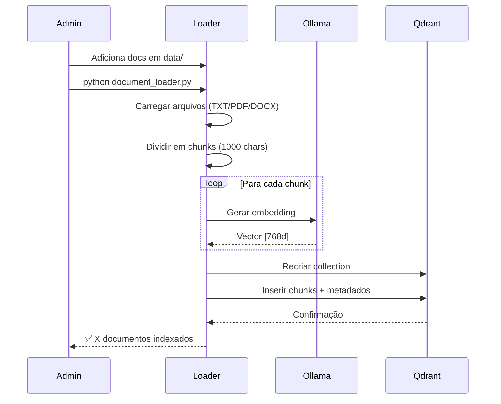
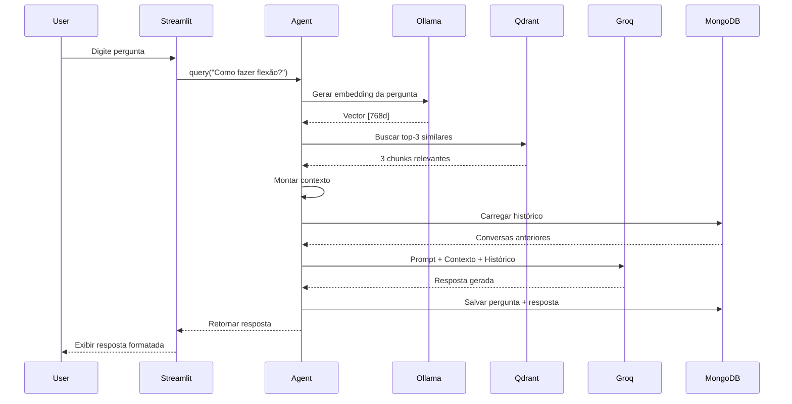
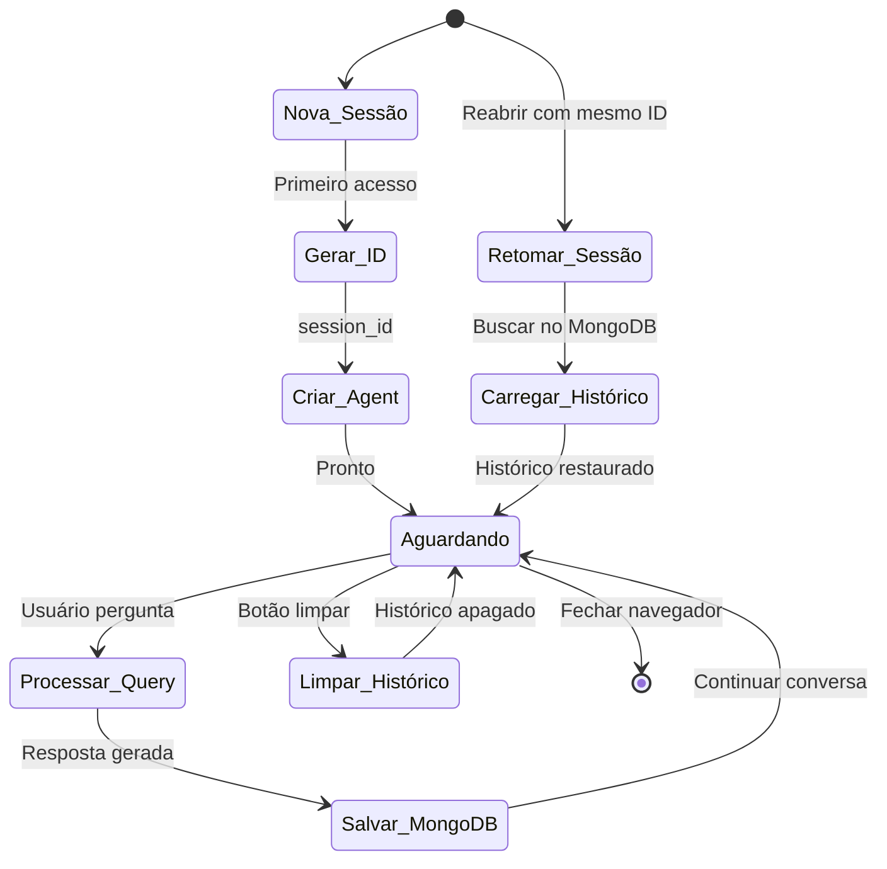
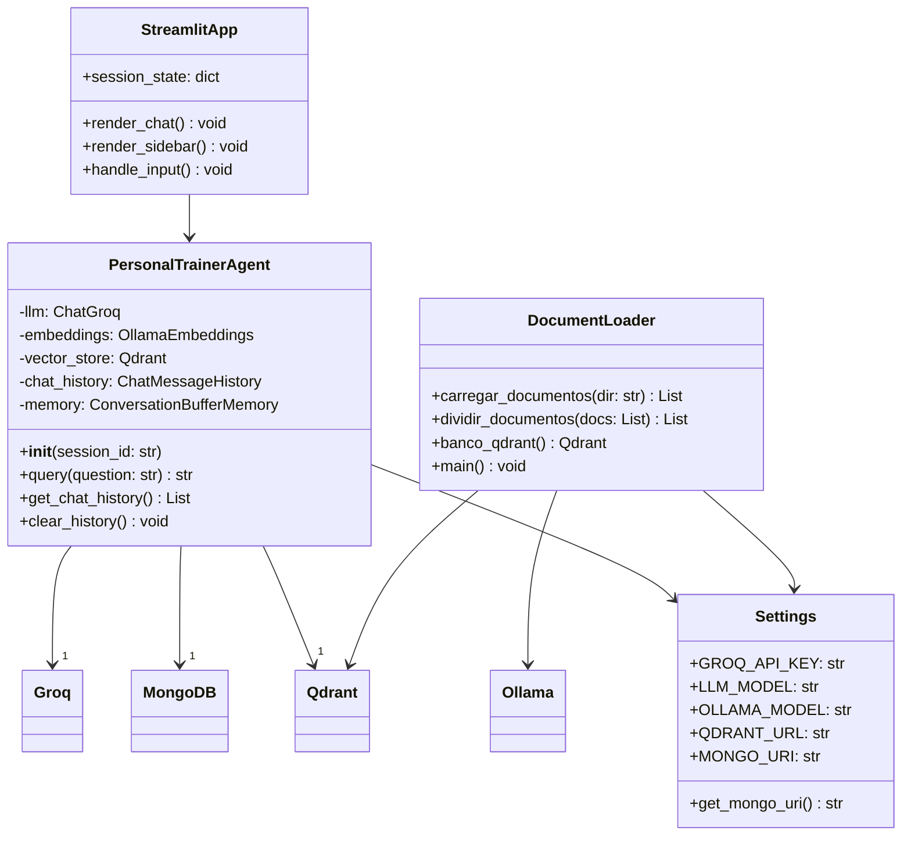

# 🏗️ Arquitetura do Sistema - Personal Trainer AI

## 📋 Visão Geral

Este documento detalha a **arquitetura técnica completa** do Personal Trainer AI, um sistema RAG (Retrieval-Augmented Generation) para assistência de treinos e fitness.

---

## 🎯 Objetivos de Design

### Princípios Arquiteturais

1. **Modularidade**: Componentes independentes e intercambiáveis
2. **Escalabilidade**: Suporte a múltiplos usuários simultâneos
3. **Performance**: Respostas em < 5 segundos
4. **Manutenibilidade**: Código limpo e documentado
5. **Confiabilidade**: Testes automatizados e logging

---

## 🏛️ Arquitetura em Camadas

```mermaid
graph TB
    subgraph "Camada de Apresentação"
        UI[Streamlit Interface]
    end
    
    subgraph "Camada de Aplicação"
        Agent[Personal Trainer Agent]
        Config[Configurações]
    end
    
    subgraph "Camada de Dados"
        Qdrant[(Qdrant<br/>Vector DB)]
        MongoDB[(MongoDB<br/>History)]
    end
    
    subgraph "Camada de IA"
        Groq[Groq LLM]
        Ollama[Ollama Embeddings]
    end
    
    subgraph "Camada de Dados"
        Loader[Document Loader]
        Docs[Documentos]
    end
    
    UI --> Agent
    Agent --> Config
    Agent --> Groq
    Agent --> Qdrant
    Agent --> MongoDB
    Qdrant --> Ollama
    Loader --> Docs
    Loader --> Ollama
    Loader --> Qdrant
    
    style UI fill:#00ff88
    style Agent fill:#00cc6a
    style Qdrant fill:#1a1a1a,stroke:#00ff88
    style MongoDB fill:#1a1a1a,stroke:#00ff88
    style Groq fill:#1a1a1a,stroke:#00ff88
    style Ollama fill:#1a1a1a,stroke:#00ff88
```



---

## 🔧 Componentes Principais

### 1. Interface de Usuário (Streamlit)

**Responsabilidades:**
- Renderizar interface de chat
- Gerenciar estado da sessão
- Capturar input do usuário
- Exibir respostas formatadas

**Tecnologias:**
- Streamlit 1.42+
- CSS personalizado
- Session State

**Arquivo:**
- `src/interface/streamlit_app.py`

---

### 2. Agente RAG (LangChain)

**Responsabilidades:**
- Orquestrar pipeline RAG
- Gerenciar memória de conversação
- Integrar LLM e vector store
- Formatar contexto e prompts

**Tecnologias:**
- LangChain 1.2+
- ConversationChain
- MongoDB Chat History

**Arquivo:**
- `src/agents/agent.py`

---

### 3. Vector Store (Qdrant)

**Responsabilidades:**
- Armazenar embeddings
- Busca por similaridade vetorial
- Indexação HNSW
- Gerenciar collections

**Tecnologias:**
- Qdrant 1.7+
- HNSW Index
- Cosine Similarity

**Configuração:**
- Dimensões: 768
- Distância: Cosine
- Collection: `rag_gym_personal`

---

### 4. LLM Provider (Groq)

**Responsabilidades:**
- Gerar respostas naturais
- Interpretar contexto
- Seguir system prompts
- Manter coerência

**Tecnologias:**
- Groq Cloud API
- LPU Inference Engine
- Modelo: openai/gpt-oss-120b

**Parâmetros:**
- Temperature: 0.7
- Max Tokens: 1000

---

### 5. Embeddings (Ollama)

**Responsabilidades:**
- Gerar vetores de texto
- Consistência semântica
- Processamento local

**Tecnologias:**
- Ollama
- Modelo: qwen3-embedding:0.6b

**Especificações:**
- Dimensões: 768
- Velocidade: ~100 embeddings/s

---

### 6. Banco de Histórico (MongoDB)

**Responsabilidades:**
- Persistir conversas
- Carregar histórico por sessão
- Gerenciar múltiplos usuários

**Tecnologias:**
- MongoDB 7.0+
- Mongo Express (UI)

**Estrutura:**
```json
{
  "_id": "session_user_123",
  "messages": [
    {"role": "user", "content": "..."},
    {"role": "assistant", "content": "..."}
  ],
  "created_at": "2024-12-11T10:00:00Z"
}
```

---

### 7. Document Loader

**Responsabilidades:**
- Carregar documentos
- Dividir em chunks
- Gerar embeddings
- Indexar no Qdrant

**Tecnologias:**
- LangChain Document Loaders
- Text Splitters
- PyPDF, Docx2txt

**Arquivo:**
- `src/loaders/document_loader.py`

---

## 🔄 Fluxos de Dados

### Fluxo 1: Indexação de Documentos



---

### Fluxo 2: Consulta do Usuário



---

### Fluxo 3: Gerenciamento de Sessão



---

## 🏗️ Infraestrutura (Docker)

### Arquitetura de Containers

```mermaid
graph TB
    subgraph "Docker Network: rag_network"
        App[streamlit-app<br/>:8501]
        Loader[document-loader<br/>one-time]
        
        subgraph "Serviços de Dados"
            Mongo[mongodb<br/>:27017]
            MongoExpress[mongo-express<br/>:8081]
            Qdrant[qdrant<br/>:6333]
            Ollama[ollama<br/>:11434]
        end
    end
    
    App --> Mongo
    App --> Qdrant
    App --> Ollama
    
    Loader --> Qdrant
    Loader --> Ollama
    
    MongoExpress --> Mongo
    
    User[Usuário] --> App
    User --> MongoExpress
    User --> Qdrant
    
    style App fill:#00ff88
    style Loader fill:#00cc6a
    style Mongo fill:#1a1a1a,stroke:#00ff88
    style Qdrant fill:#1a1a1a,stroke:#00ff88
    style Ollama fill:#1a1a1a,stroke:#00ff88
```



### Services do Docker Compose

| Service | Imagem | Porta | Função |
|---------|--------|-------|--------|
| `streamlit-app` | Custom | 8501 | Interface web |
| `document-loader` | Custom | - | Indexação (one-time) |
| `mongodb` | mongo:7.0 | 27017 | Banco de histórico |
| `mongo-express` | mongo-express | 8081 | UI do MongoDB |
| `qdrant` | qdrant/qdrant | 6333 | Vector database |
| `ollama` | ollama/ollama | 11434 | Embeddings locais |

---

## 📊 Diagrama de Classe



---

## 🔒 Segurança

### Camadas de Segurança

1. **Variáveis de Ambiente**
   - Senhas e chaves em `.env`
   - Nunca versionadas no Git
   - `.env.example` como template

2. **Network Isolation**
   - Serviços em rede Docker isolada
   - Portas expostas apenas necessárias

3. **Session Management**
   - IDs únicos por usuário
   - Histórico isolado por sessão

4. **API Keys**
   - Groq API key protegida
   - Rate limiting no provider

### Checklist de Segurança

- [x] `.env` no `.gitignore`
- [x] Senhas não hardcoded
- [x] Network Docker isolada
- [ ] HTTPS em produção (futuro)
- [ ] Autenticação de usuários (futuro)
- [ ] Rate limiting (futuro)

---

## 📈 Performance e Escalabilidade

### Métricas de Performance

| Operação | Tempo Médio | Otimização |
|----------|-------------|------------|
| Embedding (query) | 50-100ms | Ollama local |
| Busca Qdrant | 20-50ms | HNSW index |
| Geração LLM | 1-3s | Groq LPUs |
| **Total (query)** | **1.5-4s** | - |

### Bottlenecks Identificados

1. **Geração LLM** (maior impacto)
   - Solução: Groq com LPUs (já implementado)
   - Alternativa: Streaming de resposta

2. **Embeddings**
   - Solução: Ollama local (já implementado)
   - Alternativa: Cache de embeddings

3. **Busca Vetorial**
   - Solução: HNSW index (já implementado)
   - Alternativa: Filtros para reduzir espaço de busca

### Escalabilidade Horizontal

**Usuários Simultâneos:**
- Atual: ~10-20 usuários
- Com scaling: ~100+ usuários

**Estratégias:**
1. Load balancer para Streamlit
2. Replicação do Qdrant
3. MongoDB sharding
4. Ollama em cluster

---

## 🧪 Testes e Qualidade

### Pirâmide de Testes

```
       /\
      /E2E\       (Poucas) Testes end-to-end
     /------\
    /  Integ \    (Algumas) Testes de integração
   /----------\
  /  Unidade  \   (Muitas) Testes unitários
 /--------------\
```

### Tipos de Testes

1. **Testes Unitários**
   - Agent: query, history management
   - Loader: chunking, embedding
   - Config: validação de settings

2. **Testes de Integração**
   - Qdrant: busca vetorial
   - MongoDB: persistência
   - Ollama: geração de embeddings

3. **Testes E2E**
   - Fluxo completo: pergunta → resposta
   - Streamlit: interação UI

---

## 🔧 Configuração e Deploy

### Ambiente de Desenvolvimento

```bash
# Clone
git clone <repo>
cd personal-trainer-ai

# Config
cp .env.example .env
# Editar .env com suas chaves

# Iniciar
./start.sh
```

### Ambiente de Produção

**Recomendações:**

1. **Usar HTTPS**
   - Nginx com Let's Encrypt
   - Cloudflare proxy

2. **Autenticação**
   - OAuth2 (Google, GitHub)
   - JWT tokens

3. **Monitoring**
   - Prometheus + Grafana
   - Logs centralizados

4. **Backup**
   - MongoDB backup diário
   - Qdrant snapshot

---

## 📚 Stack Tecnológico Completo

### Backend

| Componente | Tecnologia | Versão |
|------------|------------|--------|
| Linguagem | Python | 3.11+ |
| Framework RAG | LangChain | 1.2+ |
| LLM | Groq (openai/gpt-oss-120b) | Latest |
| Embeddings | Ollama (qwen3-embedding:0.6b) | Latest |

### Databases

| Tipo | Tecnologia | Versão |
|------|------------|--------|
| Vector DB | Qdrant | 1.7+ |
| Document DB | MongoDB | 7.0+ |

### Frontend

| Componente | Tecnologia | Versão |
|------------|------------|--------|
| Framework | Streamlit | 1.42+ |
| Estilização | CSS Custom | - |

### DevOps

| Ferramenta | Propósito |
|------------|-----------|
| Docker | Containerização |
| Docker Compose | Orquestração |
| Shell Scripts | Automação |

---

## 📖 Referências Técnicas

### Documentação Oficial

- [LangChain Docs](https://python.langchain.com/)
- [Streamlit Docs](https://docs.streamlit.io/)
- [Qdrant Docs](https://qdrant.tech/documentation/)
- [Groq Docs](https://console.groq.com/docs)
- [Ollama Docs](https://github.com/ollama/ollama)

### Papers e Artigos

- [RAG Paper (Lewis et al., 2020)](https://arxiv.org/abs/2005.11401)
- [HNSW Algorithm](https://arxiv.org/abs/1603.09320)
- [Cosine Similarity](https://en.wikipedia.org/wiki/Cosine_similarity)

---
