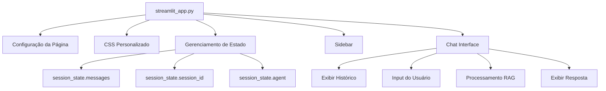
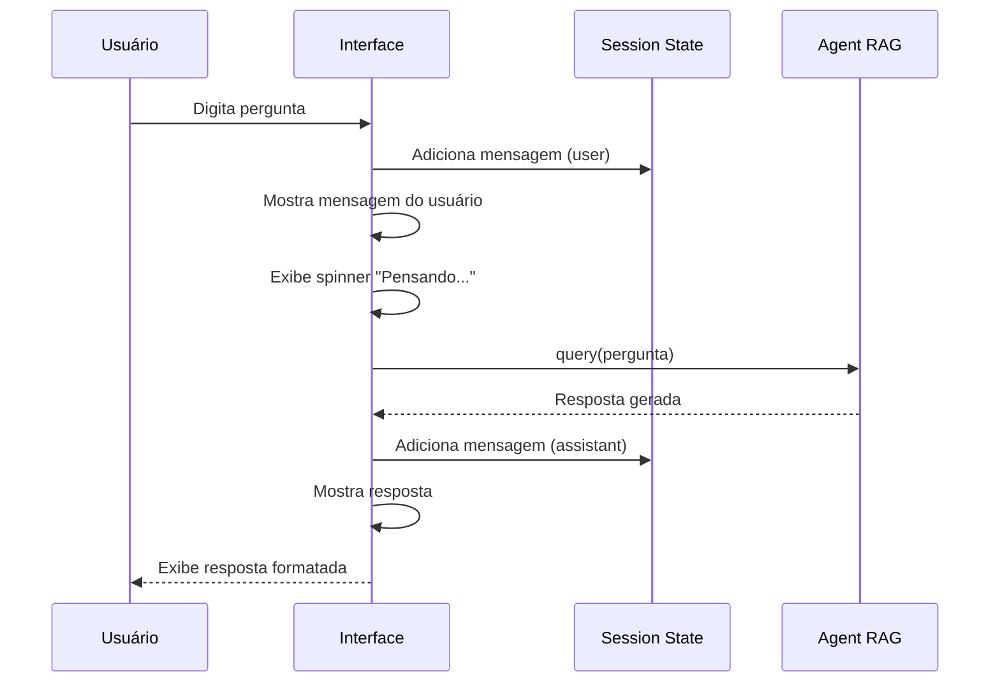

# 🎨 Documentação - Interface Streamlit

## 📋 Visão Geral

O módulo `interface` implementa a camada de apresentação do Personal Trainer AI usando **Streamlit**, oferecendo uma experiência de chat moderna e interativa com design responsivo tema verde/preto.

---

## 📁 Estrutura

```
src/interface/
├── __init__.py
└── streamlit_app.py    # Aplicação principal da interface
```

---

## 🔧 Componente Principal: `streamlit_app.py`

### Arquitetura da Aplicação



---

## 🎯 Funcionalidades Implementadas

### 1. **Configuração da Página**

```python
st.set_page_config(
    page_title="🏋️ Personal Trainer AI",
    page_icon="🏋️",
    layout="wide",
    initial_sidebar_state="expanded"
)
```

**Características:**
- Título personalizado na aba do navegador
- Ícone de haltere
- Layout amplo para melhor visualização
- Sidebar expandida por padrão

---

### 2. **Design e Estilo**

#### Paleta de Cores

```css
/* Tema Fitness Verde/Preto */
--primary-color: #00ff88      /* Verde neon */
--secondary-color: #00cc6a    /* Verde médio */
--background: #0a0a0a         /* Preto profundo */
--surface: #1a1a1a            /* Cinza escuro */
--text: #ffffff               /* Branco */
```

#### CSS Personalizado

A aplicação usa CSS injetado via `st.markdown()` para estilizar:

- **Mensagens do usuário**: Fundo verde, bordas arredondadas
- **Mensagens do assistente**: Fundo escuro, bordas verdes
- **Input**: Campo com bordas verdes e foco animado
- **Botões**: Gradiente verde com hover effects
- **Sidebar**: Fundo escuro com elementos destacados

---

### 3. **Gerenciamento de Estado**

O Streamlit usa `st.session_state` para persistir dados entre reruns.

#### Estados Mantidos

```python
# Lista de mensagens do chat
if "messages" not in st.session_state:
    st.session_state.messages = []

# ID da sessão do usuário
if "session_id" not in st.session_state:
    st.session_state.session_id = f"user_{datetime.now().strftime('%Y%m%d_%H%M%S')}"

# Instância do agente RAG
if "agent" not in st.session_state:
    st.session_state.agent = PersonalTrainerAgent(st.session_state.session_id)
```

---

### 4. **Sidebar - Configurações**

#### Layout da Sidebar

```
┌─────────────────────────┐
│ 🏋️ Personal Trainer AI  │
├─────────────────────────┤
│ ⚙️ Configurações        │
│                         │
│ 📝 ID da Sessão         │
│ [user_20241211_143022]  │
│                         │
│ 📊 Estatísticas         │
│ Mensagens: 12           │
│                         │
│ 🗑️ [Limpar Histórico]   │
│                         │
│ 💡 Dicas de Uso         │
│ • Como fazer exercício? │
│ • Quantas séries fazer? │
│ • Dieta para ganhar...  │
└─────────────────────────┘
```

#### Funcionalidades da Sidebar

##### **ID da Sessão**

```python
st.session_id = st.text_input(
    "📝 ID da Sessão",
    value=st.session_state.session_id,
    help="Identificador único da conversa"
)
```

- Permite personalizar ID da sessão
- Útil para retomar conversas anteriores
- Formato padrão: `user_YYYYMMDD_HHMMSS`

##### **Estatísticas**

```python
st.metric(
    label="📊 Mensagens Enviadas",
    value=len(st.session_state.messages) // 2
)
```

- Contador de mensagens trocadas
- Atualizado em tempo real

##### **Limpar Histórico**

```python
if st.button("🗑️ Limpar Histórico", use_container_width=True):
    st.session_state.messages = []
    st.session_state.agent.clear_history()
    st.rerun()
```

- Remove todas as mensagens da interface
- Limpa histórico do MongoDB
- Recarrega a página

##### **Dicas de Uso**

Mostra exemplos de perguntas:
- ✅ "Como fazer agachamento corretamente?"
- ✅ "Quantas séries devo fazer?"
- ✅ "Dieta para ganhar massa muscular"
- ✅ "Melhor treino para iniciantes"

---

### 5. **Interface de Chat**

#### Estrutura do Chat

```
┌───────────────────────────────────┐
│ 🏋️ Personal Trainer AI - Chat    │
├───────────────────────────────────┤
│                                   │
│  👤 Como fazer agachamento?       │
│  ┌─────────────────────────────┐ │
│                                   │
│  🤖 Para fazer agachamento...     │
│  └─────────────────────────────┘ │
│                                   │
│  👤 Quantas séries?               │
│  ┌─────────────────────────────┐ │
│                                   │
│  🤖 Recomendo 3-4 séries...       │
│  └─────────────────────────────┘ │
│                                   │
├───────────────────────────────────┤
│ [Digite sua pergunta...]          │
└───────────────────────────────────┘
```

#### Exibir Histórico

```python
for message in st.session_state.messages:
    with st.chat_message(message["role"]):
        st.markdown(message["content"])
```

**Fluxo:**
1. Itera sobre todas as mensagens salvas
2. Cria container com ícone apropriado (👤 ou 🤖)
3. Renderiza conteúdo com formatação Markdown

---

#### Input do Usuário

```python
if prompt := st.chat_input("💬 Digite sua pergunta sobre treino e fitness..."):
    # Adiciona mensagem do usuário
    st.session_state.messages.append({"role": "user", "content": prompt})
    
    # Exibe mensagem
    with st.chat_message("user"):
        st.markdown(prompt)
    
    # Processa com agente RAG
    with st.chat_message("assistant"):
        with st.spinner("🤔 Pensando..."):
            response = st.session_state.agent.query(prompt)
        st.markdown(response)
    
    # Salva resposta
    st.session_state.messages.append({"role": "assistant", "content": response})
```

**Elementos:**
- **Input fixo**: Sempre visível no rodapé
- **Placeholder**: Orientação contextual
- **Enter para enviar**: Submit ao pressionar Enter

---

#### Processamento da Resposta

**Indicadores Visuais:**

1. **Spinner**: Animação "Pensando..." durante processamento
2. **Streaming** (futuro): Resposta sendo digitada em tempo real
3. **Erro handling**: Mensagens amigáveis em caso de falha

```python
with st.spinner("🤔 Pensando..."):
    try:
        response = st.session_state.agent.query(prompt)
        st.markdown(response)
    except Exception as e:
        st.error(f"❌ Erro ao processar pergunta: {str(e)}")
```

---

## 🎨 Componentes Visuais

### 1. **Cabeçalho**

```python
st.title("🏋️ Personal Trainer AI")
st.markdown("Seu assistente inteligente de treino e fitness")
```

- Ícone de haltere
- Título principal em destaque
- Subtítulo descritivo

---

### 2. **Mensagens de Chat**

#### Mensagem do Usuário

```css
.user-message {
    background: linear-gradient(135deg, #00ff88, #00cc6a);
    color: #0a0a0a;
    padding: 15px;
    border-radius: 15px;
    margin: 10px 0;
}
```

- Fundo verde gradiente
- Texto escuro para contraste
- Bordas arredondadas
- Alinhado à direita

#### Mensagem do Assistente

```css
.assistant-message {
    background: #1a1a1a;
    color: #ffffff;
    border-left: 4px solid #00ff88;
    padding: 15px;
    border-radius: 15px;
    margin: 10px 0;
}
```

- Fundo escuro
- Borda verde à esquerda
- Texto branco
- Alinhado à esquerda

---

### 3. **Botões**

```css
.stButton button {
    background: linear-gradient(90deg, #00ff88, #00cc6a);
    color: #0a0a0a;
    border: none;
    padding: 10px 20px;
    border-radius: 8px;
    font-weight: bold;
    transition: all 0.3s;
}

.stButton button:hover {
    transform: translateY(-2px);
    box-shadow: 0 4px 12px rgba(0, 255, 136, 0.4);
}
```

- Gradiente verde
- Hover com elevação
- Sombra animada
- Transição suave

---

## 🔄 Fluxo de Interação



---

## ⚙️ Configurações Técnicas

### Variáveis de Configuração

```python
# Layout
layout = "wide"
initial_sidebar_state = "expanded"

# Tema (arquivo .streamlit/config.toml)
[theme]
primaryColor = "#00ff88"
backgroundColor = "#0a0a0a"
secondaryBackgroundColor = "#1a1a1a"
textColor = "#ffffff"
font = "sans serif"
```

### Performance

- **Auto-rerun**: Streamlit recarrega a página a cada interação
- **Cache**: Agente RAG é mantido em `session_state`
- **Lazy loading**: Histórico carregado sob demanda

---

## 🚀 Como Executar

### Via Docker (Recomendado)

```bash
docker-compose up streamlit-app
```

Acesse: http://localhost:8501

### Localmente

```bash
# Ativar ambiente virtual
source venv/bin/activate

# Executar Streamlit
streamlit run src/interface/streamlit_app.py
```

---

## 🎯 Casos de Uso

### 1. Conversa Básica

1. Usuário acessa http://localhost:8501
2. Digita: "Como fazer flexão?"
3. Sistema processa e responde
4. Histórico é salvo automaticamente

### 2. Sessão Personalizada

1. Na sidebar, alterar "ID da Sessão" para "meu_treino_2024"
2. Fazer perguntas
3. Fechar navegador
4. Reabrir e usar mesmo ID
5. Histórico é recuperado

### 3. Nova Conversa

1. Clicar em "Limpar Histórico"
2. Histórico é apagado
3. Começar nova conversa do zero

---

## 🐛 Troubleshooting

### Erro: `Address already in use`

```bash
# Verificar processo na porta 8501
lsof -i :8501

# Matar processo
kill -9 <PID>

# Ou usar outra porta
streamlit run src/interface/streamlit_app.py --server.port 8502
```

### Interface não atualiza

```bash
# Forçar reload
Ctrl + R no navegador

# Ou rerun via código
st.rerun()
```

### CSS não aplicado

```bash
# Limpar cache do Streamlit
streamlit cache clear

# Reiniciar servidor
Ctrl + C
streamlit run src/interface/streamlit_app.py
```

---

## 📚 Referências

- [Streamlit Documentation](https://docs.streamlit.io/)
- [Streamlit Chat Elements](https://docs.streamlit.io/library/api-reference/chat)
- [Custom CSS in Streamlit](https://docs.streamlit.io/library/api-reference/utilities/st.markdown)

---

**Última atualização**: 11 de fevereiro de 2026
