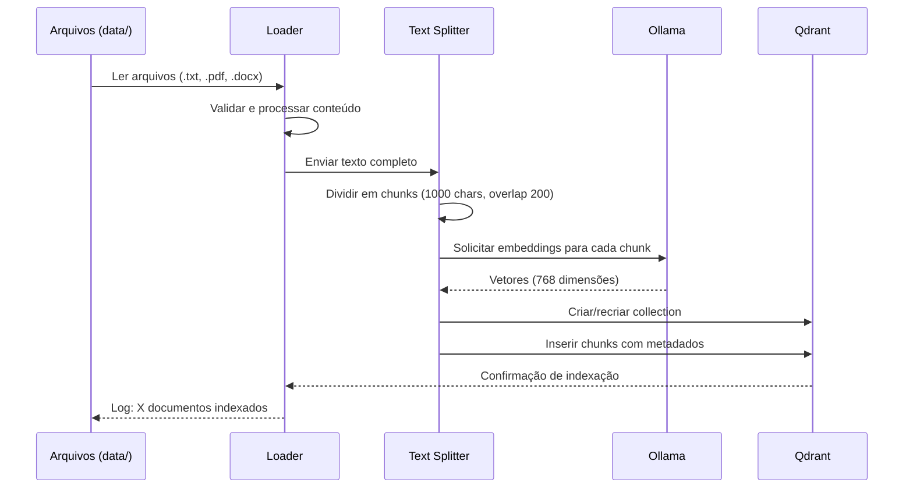

# 📚 Documentação - Loaders e Indexação

## 📋 Visão Geral

O módulo `loaders` é responsável por **carregar, processar e indexar** documentos no sistema Personal Trainer AI. Ele converte arquivos de diferentes formatos em vetores que alimentam o sistema RAG.

---

## 📁 Estrutura

```
src/loaders/
├── __init__.py
└── document_loader.py    # Processamento e indexação de documentos
```

---

## 🔧 Componente Principal: `document_loader.py`

### Funcionalidades Principais

1. **Carregamento Multi-formato**: TXT, PDF, DOCX
2. **Chunking Inteligente**: Divisão de textos em pedaços otimizados
3. **Geração de Embeddings**: Conversão de chunks em vetores
4. **Indexação Qdrant**: Armazenamento vetorial para busca semântica

---

## 📊 Fluxo de Processamento


### Detalhamento do Fluxo



---

## 🔧 Funções Principais

### 1. `carregar_documentos(diretorio: str) -> List[Document]`

Carrega todos os documentos de uma pasta, suportando múltiplos formatos.

**Parâmetros:**
- `diretorio` (str): Caminho para a pasta com documentos

**Retorno:**
- `List[Document]`: Lista de objetos Document do LangChain

**Formatos Suportados:**

#### `.txt` - Arquivos de Texto

```python
from langchain.document_loaders import TextLoader

loader = TextLoader(arquivo, encoding='utf-8')
docs = loader.load()
```

- Encoding UTF-8 para suporte completo de caracteres
- Preserva formatação original
- Ideal para: Artigos, guias, instruções

#### `.pdf` - Arquivos PDF

```python
from langchain.document_loaders import PyPDFLoader

loader = PyPDFLoader(arquivo)
docs = loader.load()
```

- Extrai texto de todas as páginas
- Preserva metadados (página, título)
- Ideal para: eBooks, artigos científicos, manuais

#### `.docx` - Documentos Word

```python
from langchain.document_loaders import Docx2txtLoader

loader = Docx2txtLoader(arquivo)
docs = loader.load()
```

- Extrai texto formatado
- Preserva parágrafos e quebras de linha
- Ideal para: Relatórios, planos de treino

**Exemplo de Uso:**

```python
from src.loaders.document_loader import carregar_documentos

# Carregar todos os documentos da pasta data/
docs = carregar_documentos("data/")

print(f"Total de documentos: {len(docs)}")
for doc in docs:
    print(f"- {doc.metadata['source']}")
```

---

### 2. `dividir_documentos(documentos: List[Document]) -> List[Document]`

Divide documentos grandes em chunks menores com overlap para contexto.

**Parâmetros:**
- `documentos` (List[Document]): Documentos carregados

**Retorno:**
- `List[Document]`: Chunks de texto com metadados

**Configuração do Splitter:**

```python
from langchain.text_splitter import RecursiveCharacterTextSplitter

text_splitter = RecursiveCharacterTextSplitter(
    chunk_size=1000,        # Tamanho de cada chunk
    chunk_overlap=200,      # Sobreposição entre chunks
    length_function=len,    # Função para calcular tamanho
    separators=["\n\n", "\n", " ", ""]  # Prioridade de separação
)
```

**Parâmetros Explicados:**

| Parâmetro | Valor | Explicação |
|-----------|-------|------------|
| `chunk_size` | 1000 | Cada chunk terá ~1000 caracteres |
| `chunk_overlap` | 200 | 200 caracteres se repetem entre chunks consecutivos |
| `separators` | `["\n\n", "\n", " ", ""]` | Tenta dividir por parágrafos, linhas, palavras, caracteres |

**Por que overlap?**

O overlap garante que contexto não seja perdido entre chunks:

```
Chunk 1: "...exercício X é importante. A técnica correta envolve..."
                                     ^^^^^^^^^^^^^^^^^^^^
Chunk 2: "...técnica correta envolve postura adequada..."
```

**Exemplo:**

```python
from src.loaders.document_loader import carregar_documentos, dividir_documentos

docs = carregar_documentos("data/")
chunks = dividir_documentos(docs)

print(f"Documentos originais: {len(docs)}")
print(f"Chunks gerados: {len(chunks)}")
# Saída: Documentos originais: 4 / Chunks gerados: 87
```

---

### 3. `banco_qdrant() -> Qdrant`

Cria ou conecta ao vector store Qdrant para indexação.

**Retorno:**
- `Qdrant`: Instância do vector store

**Configuração:**

```python
from langchain_community.vectorstores import Qdrant
from qdrant_client import QdrantClient

client = QdrantClient(url=settings.QDRANT_URL)

vector_store = Qdrant(
    client=client,
    collection_name=settings.QDRANT_COLLECTION,
    embeddings=OllamaEmbeddings(
        model=settings.OLLAMA_MODEL,
        base_url=settings.OLLAMA_BASE_URL
    )
)
```

**O que faz:**
1. Conecta ao servidor Qdrant
2. Cria collection se não existir
3. Configura embeddings Ollama
4. Retorna instância pronta para uso

**Exemplo:**

```python
from src.loaders.document_loader import banco_qdrant

# Conectar ao Qdrant
db = banco_qdrant()

# Buscar documentos similares
resultados = db.similarity_search("como fazer flexão", k=3)

for doc in resultados:
    print(doc.page_content[:100])
```

---

### 4. `main()` - Processo Completo de Indexação

Orquestra todo o pipeline de carga e indexação.

**Fluxo:**

```python
def main():
    print("🔄 Iniciando carregamento de documentos...")
    
    # 1. Carregar documentos da pasta data/
    documentos = carregar_documentos("data/")
    print(f"✅ {len(documentos)} documentos carregados")
    
    # 2. Dividir em chunks
    chunks = dividir_documentos(documentos)
    print(f"✅ {len(chunks)} chunks criados")
    
    # 3. Conectar ao Qdrant
    vector_store = banco_qdrant()
    
    # 4. Recriar collection (limpa dados antigos)
    vector_store.client.recreate_collection(
        collection_name=settings.QDRANT_COLLECTION,
        vectors_config=VectorParams(size=768, distance=Distance.COSINE)
    )
    
    # 5. Indexar chunks
    vector_store.add_documents(chunks)
    print(f"✅ {len(chunks)} chunks indexados no Qdrant")
    
    print("🎉 Indexação concluída com sucesso!")
```

**Execução:**

```bash
# Via Python
python src/loaders/document_loader.py

# Via Docker
docker-compose run document-loader
```

**Saída Esperada:**

```
🔄 Iniciando carregamento de documentos...
✅ 4 documentos carregados
✅ 87 chunks criados
✅ 87 chunks indexados no Qdrant
🎉 Indexação concluída com sucesso!
```

---

## 📐 Especificações Técnicas

### Vector Configuration

```python
from qdrant_client.models import VectorParams, Distance

vectors_config = VectorParams(
    size=768,                    # Dimensão do embedding (Ollama qwen3)
    distance=Distance.COSINE     # Métrica de similaridade
)
```

**Métricas de Distância:**

| Métrica | Descrição | Quando Usar |
|---------|-----------|-------------|
| `COSINE` | Similaridade cosseno (0-1) | **Recomendado** para texto |
| `EUCLIDEAN` | Distância euclidiana | Dados numéricos |
| `DOT` | Produto escalar | Embeddings normalizados |

### Metadados dos Chunks

Cada chunk armazenado contém:

```python
{
    "page_content": "Texto do chunk...",
    "metadata": {
        "source": "data/documento.txt",  # Arquivo de origem
        "chunk_id": 5,                   # Índice do chunk
        "total_chunks": 23               # Total de chunks do documento
    }
}
```

---

## 🔄 Reindexação

### Quando Reindexar?

- ✅ Novos documentos adicionados em `data/`
- ✅ Documentos existentes modificados
- ✅ Mudança no modelo de embedding
- ✅ Ajuste nos parâmetros de chunking

### Como Reindexar

```bash
# 1. Adicionar/modificar arquivos em data/
cp novo_documento.pdf data/

# 2. Executar o loader
python src/loaders/document_loader.py

# Ou via Docker
docker-compose run document-loader
```

**⚠️ Atenção**: A reindexação **apaga todos os dados anteriores** e recria a collection do zero.

---

## 🎯 Casos de Uso

### 1. Adicionar Novos Documentos

```bash
# 1. Copiar documento para data/
cp "Guia_Avançado_Musculação.pdf" data/

# 2. Reindexar
python src/loaders/document_loader.py
```

### 2. Atualizar Documento Existente

```bash
# 1. Substituir arquivo
cp "Treino_Pernas_v2.txt" data/Treino_Pernas.txt

# 2. Reindexar
python src/loaders/document_loader.py
```

### 3. Verificar Documentos Indexados

```python
from src.loaders.document_loader import banco_qdrant

db = banco_qdrant()
info = db.client.get_collection(collection_name="rag_gym_personal")

print(f"Vectors count: {info.vectors_count}")
print(f"Points count: {info.points_count}")
```

---

## ⚙️ Configurações

### Variáveis de Ambiente

```bash
# Qdrant
QDRANT_URL=http://localhost:6333
QDRANT_COLLECTION=rag_gym_personal

# Ollama Embeddings
OLLAMA_MODEL=qwen3-embedding:0.6b
OLLAMA_BASE_URL=http://localhost:11434
```

### Parâmetros Ajustáveis

```python
# Text Splitter
chunk_size = 1000         # Aumentar para chunks maiores
chunk_overlap = 200       # Aumentar para mais contexto

# Retrieval
k = 3                     # Número de chunks a recuperar
```

---

## 📊 Performance

### Métricas de Indexação

| Métrica | Valor Típico |
|---------|--------------|
| Velocidade de leitura | ~100 docs/min |
| Chunking | ~1000 chunks/min |
| Embedding | ~50-100 chunks/min |
| Indexação Qdrant | ~200 chunks/min |

### Otimizações

- ✅ Processamento em batch de embeddings
- ✅ HNSW index no Qdrant para busca rápida
- ✅ Lazy loading de documentos grandes
- ✅ Cache de embeddings (futuro)

---

## 🐛 Troubleshooting

### Erro: `Cannot connect to Ollama`

```bash
# Verificar se Ollama está rodando
curl http://localhost:11434/api/tags

# Iniciar Ollama
docker-compose up -d ollama

# Baixar modelo de embedding
docker-compose exec ollama ollama pull qwen3-embedding:0.6b
```

### Erro: `Collection already exists`

Isso é esperado! O script recria a collection automaticamente.

### Erro: `UnicodeDecodeError`

```python
# Ajustar encoding no TextLoader
loader = TextLoader(arquivo, encoding='utf-8')

# Ou tentar latin-1
loader = TextLoader(arquivo, encoding='latin-1')
```

### Documentos não encontrados

```bash
# Verificar arquivos em data/
ls -la data/

# Verificar formato suportado
# ✅ .txt, .pdf, .docx
# ❌ .doc, .odt, .rtf
```

---

## 🚀 Próximas Melhorias

- [ ] Suporte para mais formatos (HTML, Markdown, EPUB)
- [ ] Detecção automática de encoding
- [ ] Processamento paralelo de documentos
- [ ] Cache de embeddings
- [ ] Indexação incremental (sem recriar collection)
- [ ] Metadados adicionais (autor, data, tags)
- [ ] Preview de chunks antes de indexar
- [ ] Validação de qualidade dos chunks

---

## 📚 Referências

- [LangChain Document Loaders](https://python.langchain.com/docs/modules/data_connection/document_loaders/)
- [Text Splitters](https://python.langchain.com/docs/modules/data_connection/document_transformers/)
- [Qdrant Quick Start](https://qdrant.tech/documentation/quick-start/)
- [Ollama Embeddings](https://ollama.ai/library/qwen3-embedding)

---

**Última atualização**: 11 de fevereiro de 2026
